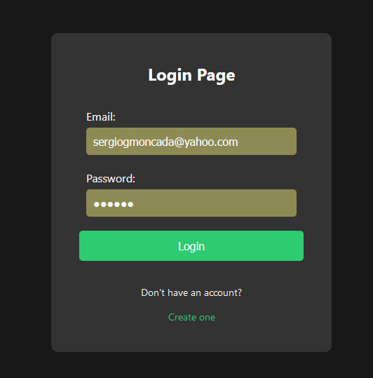
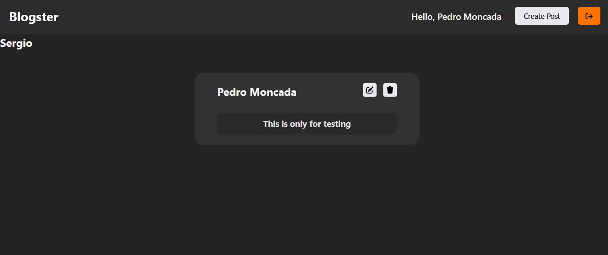
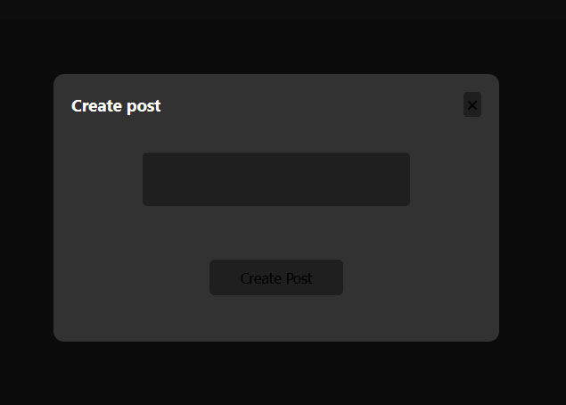
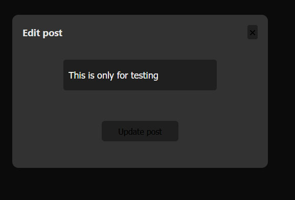

<h1 align ="center" > 🏆 FirebaseDBNotes  </h1>
<h1  align ="center"> 
React JSX - MongoDB Auth and Db - EDIT/ADD/REMOVE notes </h1>
<br>

  * [Configuration and Setup](#configuration-and-setup)
  * [Key Features](#key-features)
  * [Technologies used](#technologies-used)
      - [Frontend](#frontend)
  * [📸 Screenshots](#screenshots)
  * [Author](#author)
  * <br>
  * ## Configuration and Setup

In order to run this project locally, simply fork and clone the repository or download as zip and unzip on your machine.

- Open the project in your prefered code editor.
- Go to terminal -> New terminal (If you are using VS code)
- Split your terminal into two (run the client on one terminal and the server on the other terminal)


```
$ cd client
$ npm install (to install client-side dependencies)
$ npx start -c  (to start the application - cleaning Cache Memory)
NODE VERSION: 19.2.0

```
In the second terminal

- cd server and Set environment variables in .env
- Create your mongoDB connection url, which you'll use as your MONGO_URL
- Supply the following credentials

```
#  --- .env  ---

MONGO_URL = 'mongodb://0.0.0.0:27017/blogcrud01' -- YOUR DATABASE NAME
PORT = 3500
JWT_ACCESS_TOKEN='Sergio'
```


## ✔️ Tecnologias Utilizadas:


<br>
##  Screenshots:
<br>




<br>

##  Key Features:

- User registration and login.
- Authentication. 
- Add, edit, delete Notes.
- Email and Password Validation.
  
  
<br/>

##  Technologies used

This project was created using the following technologies.

####  Frontend 

- [React]() - It is a framework developed by Facebook for creating spa under one common language, JavaScript.
- [React Hooks](https://reactjs.org/docs/hooks-intro.html) - For managing and centralizing application state
- [react-navigation](https://reactnavigation.org/)) - To handle routing
- [MongoDb](https://firebase.google.com/?gad_source=1&gclid=Cj0KCQiAoKeuBhCoARIsAB4Wxte5kKnjJzYp7DGbeK4wD-BU_i0Oke02VWuSac2NMBDt4wD48sqWYuUaAsBREALw_wcB&gclsrc=aw.ds&hl=es-419) - es una base de datos NoSQL que te permite almacenar y sincronizar datos entre tus usuarios en tiempo real.
- [css3](https://styled-components.com/docs/basics) - Utilises tagged template literals to style your components
- [React Redux-toolkit](https://react-redux.js.org/) - manage application state efficiently and provide a more structured mechanism for managing data

## Author
- Portfolio: 
- Github: 
- Sponsor: 
- Linkedin:(https://www.linkedin.com/in/sergio-moncada-72589883/)
- Email: [sergiogmoncada@yahoo.com](mailto:sergiogmoncada@yahoo.com)

